# kern architecture — full system graph

One graph, every subsystem and the edges between them.

```mermaid
graph TB
    %% ===== external callers =====
    CLI["CLI kern &lt;cmd&gt;"]
    MCPC["MCP client (Claude Code)"]
    BROWSER["Browser"]
    PEER["Peer daemons (forest)"]
    FS["Filesystem / journal"]

    %% ===== interfaces =====
    subgraph IFACE["Interfaces"]
        DISPATCH["commands::dispatch"]
        MCP["mcp::Server (stdio+SSE)"]
        RPC["kern_rpc socket (kern.sock)"]
        VIEWER["viewer.rs — hub :7700<br/>/graph /ask /edit"]
        REPL["repl.rs"]
    end

    CLI --> DISPATCH
    MCPC -->|stdio/proxy| MCP
    MCPC -.->|attach| RPC
    BROWSER --> VIEWER
    MCP --> RPC
    DISPATCH --> RPC
    REPL --> CORE

    %% ===== daemon lifecycle =====
    subgraph LIFE["Daemon lifecycle (main → run_server)"]
        MAIN["main.rs — multi-thread rt, workers=max(cores,4)"]
        WD["watchdog OS thread<br/>exit(101) on 30s stall → frees :7700"]
        WARM["warm loop /240s<br/>join!(embed, answer)"]
        MAIN --> WD --> WARM
    end
    MAIN --> DISPATCH

    %% ===== ingest sources =====
    subgraph SRC["Ingest sources (fire-and-forget)"]
        CS["capture_spool::run<br/>spool/*.txt /poll_secs"]
        FWs["file_watcher::run"]
        SMs["session_mirror::run<br/>journal fork events"]
    end
    FS --> FWs
    FS --> SMs

    %% ===== ingest pipeline =====
    subgraph INGEST["Ingest pipeline (ingest::Worker)"]
        Q["Worker job (mpsc)<br/>text, Source, kind, descriptor, conf"]
        SPLIT["split::split → chunks"]
        PDOC["place_document (embed doc)"]
        DDOC{"find_duplicate<br/>entity_idx k=1 ef=64 ≥0.95?"}
        UPD["update_existing_entity<br/>observe_support + Rephrase edge<br/>(never overwrites text/vec)"]
        EMB["embed_chunks<br/>batch → retry [150,300,600]ms"]
        PCH["place_chunks"]
        BUILD["build_chunk_entity<br/>id=hash(text), conf=Beta(1+c,2-c)"]
        GQ["generate_questions → ≤3 Question edges"]
    end
    CS -->|extract_claims→distill| Q
    FWs -->|IngestRecord| Q
    SMs -->|ingest_session| Q
    Q --> SPLIT --> PDOC --> DDOC
    DDOC -->|yes| UPD
    DDOC -->|no| ACCEPT
    PDOC --> EMB --> PCH --> BUILD --> ACCEPT
    PCH --> GQ

    %% ===== accept / routing =====
    subgraph ACC["accept::accept"]
        RT["route_entity ≤64 hops<br/>route_to_child_id by anchor_vec (floor .5)<br/>acceptance_prob(inner=.15,outer=.35)<br/>root → generic catch-all if no anchor matches"]
        CMT["commit_entity → kern.entities + entity_idx"]
        RSN["reason edges: Similarity(top2)+Provenance+Supersedes"]
        RT --> CMT --> RSN
    end
    ACCEPT([accept]) --> RT
    UPD --> SAVE
    RSN --> SAVE["save_fn() → persist"]
    GQ --> RSN

    %% ===== core graph =====
    subgraph CORE["Core — Arc&lt;RwLock&lt;GraphGnn&gt;&gt;"]
        GRAPH["GraphGnn: kerns tree + unloaded set"]
        EIDX["entity_idx (HNSW)"]
        GIDX["gnn_entity_idx (HNSW)"]
        RIDX["reason_idx (HNSW)"]
        LEXI["lexical BM25 index"]
        K["Kern{anchor_text, anchor_vec, inner/outer_radius, parent, children, gnn_weights}"]
        ENT["Entity{id=hash, kind, status, vector, gnn_vector,<br/>conf α/β, heat, access_count(CRDT), dirty, source}"]
        REA["Reason{id=hash, from, to, to_kern_id, to_net_id,<br/>kind, vector, traversal_count(CRDT)}"]
        GRAPH --> K
        K --> ENT
        K --> REA
        ENT -. from/to .- REA
        GRAPH --- EIDX & GIDX & RIDX & LEXI
    end
    CMT --> GRAPH
    CMT --> EIDX
    RSN --> RIDX

    %% ===== retrieval =====
    subgraph RETR["Retrieval (answer::query)"]
        HYDE["hyde::expand_query (blend w=0.5)"]
        SEED["seed::seed (Content|Reason|Hybrid)"]
        FUSE["RRF fuse 1/(60+rank) gw=0.5"]
        PR["pagerank PPR d=0.85 25it"]
        EXP["expand:: beam search → path_chains<br/>prune &lt; best·decay 0.25"]
        MRG["merge:: log-sum-exp corroboration"]
        BST["score: ·conf + QBST + fact_boost 0.3"]
        FLT["filter_delivery (drop Superseded, cap 25)"]
        MMR["mmr λ=0.45 + dedup_by_section"]
        RRK["rerank::llm_rerank top-30"]
        CMA["commit_access: access++ + deposit heat"]
        BAP["build_answer_prompt (chains+facts+Q)"]
        HYDE --> SEED --> FUSE --> PR --> EXP --> MRG --> BST --> FLT --> MMR --> RRK --> CMA --> BAP
    end
    RPC --> HYDE
    VIEWER --> HYDE
    SEED -->|search 0.4·entity+0.6·gnn| EIDX
    SEED -->|search| GIDX
    SEED -->|BM25| LEXI
    EXP --> GRAPH
    CMA --> ENT
    BAP --> LLM_ANS

    %% ===== tick + gnn =====
    subgraph TICK["Tick (autonomic /interval_secs)"]
        PULSE["pulse: recurse tree, deposit heat"]
        QUE["Queue (mpsc dedup, cap 512)"]
        CL["do_cluster (vector_cluster≥cohesion)<br/>spawn kerns → Name/Enrich"]
        NM["do_name (LLM anchor name → radii; promote generic cluster → root)"]
        EN["do_enrich (LLM edge label → reason_idx)"]
        RQ["do_resolve (answer ≥0.80 else broadcast up)"]
        ST["StigmergyGc: heat&lt;0.01 AND age&gt;7d AND not Fact/Doc"]
        RB["do_reembed (dirty → vector/gnn_vector)"]
        PS["do_persist → save_kern"]
        PULSE --> QUE
        QUE --> CL & NM & EN & RQ & ST & RB & PS
        CL --> NM & EN
    end
    subgraph GNN["GnnPropagate"]
        SNAP["build_gnn_snapshot (features+edges+weights)"]
        TRAIN["2-layer GCN dim→hidden→dim<br/>link-pred loss, Adam, 24 epochs (skip &lt;128)"]
        BLEND["blend 0.6·orig+0.4·learned → L2"]
        APPLY["apply → entity.gnn_vector → gnn_entity_idx"]
        SNAP --> TRAIN --> BLEND --> APPLY
    end
    PULSE --> GRAPH
    CL -->|structural change| SNAP
    EN --> SNAP
    APPLY --> GIDX
    EN --> RIDX
    RB --> ENT
    ST --> COLD

    %% ===== persistence / tiering =====
    subgraph STORE["Persistence (.kern) + tiering"]
        KF["&lt;id&gt;.kern bincode + root.kern"]
        UNL["QUARANTINE: unloaded set<br/>auto-reload on get(); root never evicted"]
        COLD["COLD: cold/cold.jsonl<br/>latest-wins, compact@256KiB, cap 50k"]
        QM["_quant.meta (None|Int8)"]
        DG["digest.md (SessionStart)"]
        KF --- QM
        KF -->|LRU enforce_kern_cap| UNL
        UNL -->|load_kern| KF
    end
    SAVE --> KF
    PS --> KF
    GRAPH <--> KF
    GRAPH -->|gc_empty_kerns leaf-first| KF
    COLD -->|cold::search on demand| GRAPH
    TICK --> DG

    %% ===== gossip + crdt (optional) =====
    subgraph GOSSIP["Gossip forest (off by default)"]
        ND["gossip::Node — peers≤50, SeenSet TTL60s, RateClipper"]
        DISC["discovery UDP multicast 239.77.75.68 /10s"]
        ANN["announce Sphere /30s + entity_sync top32 /30s"]
        FAN["broadcast → 3 random peers"]
        HND["handler: Sphere|Question|Pulse|Delta|EntitySync"]
        CRDT["GCounter per-slot max (commutative, idempotent)"]
        DISC --> ND
        ANN --> FAN --> ND
        ND --> HND --> CRDT
    end
    PEER <-->|TCP| FAN
    PEER -->|inbound| HND
    HND -->|phantom remote-net-kern, persist| GRAPH
    HND -->|handle_pulse| PULSE
    CRDT -->|merge access/traversal counts| GRAPH

    %% ===== llm =====
    subgraph LLM["llm::Client (Ollama)"]
        EMBED_M["embed /api/embed num_ctx=2048 keep10m"]
        REASON_M["reason /api/chat num_gpu:0 (CPU)"]
        ANS_M["answer /api/chat think:false num_ctx=8192"]
    end
    LLM_ANS([answer stream]) --> ANS_M
    EMB --> EMBED_M
    SPLIT --> REASON_M
    NM --> REASON_M
    EN --> REASON_M
    GQ --> REASON_M
    RRK --> REASON_M
    SEED -.embed query.-> EMBED_M
    WARM --> EMBED_M
    WARM --> ANS_M

    %% ===== config =====
    CFG["Config (.kern): [embed][reason][answer][serve]<br/>[retrieval][ingest][gossip][tick][gnn][graph][watcher][capture][journal]"]
    CFG -.tunes.-> RETR
    CFG -.tunes.-> INGEST
    CFG -.tunes.-> TICK
    CFG -.tunes.-> LLM
    CFG -.tunes.-> GOSSIP
```

## Load-bearing invariants

- **Content-addressed IDs** — `id = sha256(text)`; equal ids ⇒ identical content. Dedup updates metadata only, never text/vector → CRDT-safe.
- **Confidence replica-local** — Beta(α,β) never merged from remote (anti-poisoning); only access/traversal GCounters federate.
- **Reason hosting** — edge lives in its `from` kern; `to_kern_id`/`to_net_id` stamp cross-kern / cross-network targets.
- **Hybrid score** — `0.4·entity_idx + 0.6·gnn_entity_idx` wherever search runs.
- **Heat → GC** — exp decay (~36h half-life); reaped when `heat<0.01 AND age>7d AND kind∉{Fact,Document}`.
- **Watchdog** — OS thread force-exits on 30s async stall so a peer seizes `:7700`.

Notes: `diskann.rs` is built+tested but **not wired** into live search (hnsw is).
`[graph] max_kerns` defaults to `usize::MAX` (cap off) — empty-kern GC keeps it from bloating.
