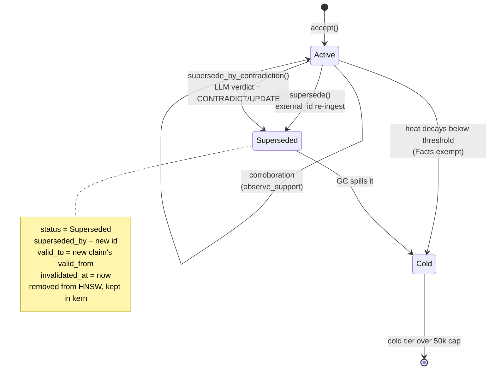

# Time & contradiction

kern tracks two independent clocks on every thought: when a statement was true in the world, and when kern found out about it. This page explains why one clock is not enough, how a contradiction turns into a supersede, and what a query asking about the past actually gets back.

## The failure mode this exists to prevent

A memory system that cannot revise is worse than no memory at all.

Consider an agent told in January that the deadline is March, and told again in February that it moved to April. A system with no revision mechanism now holds both statements, ranks them by embedding similarity, and returns whichever happens to score higher. The two statements are nearly identical in vector space and mean opposite things, so the ranking is effectively arbitrary. The agent will confidently assert a false deadline, and it will do so *because* it has memory — a stateless agent would have asked.

Deletion is not the fix. If you delete the March claim, you lose the ability to answer "what did we think in January?", you lose the audit trail explaining why a decision made in January looks wrong in hindsight, and you lose the evidence that the deadline moved at all. You have traded a wrong answer for an unexplainable one.

kern's answer is to make revision a first-class, reversible, queryable operation: the old claim is *invalidated*, not removed. It stops being retrievable by default, keeps its place in the graph, and remains reachable on request.

## Two clocks, not one

The two axes are stored on `Entity` as `valid_from`/`valid_to` for world time and `invalidated_at` for transaction time (`src/base/types.rs:288` documents this split in the code).

**World time** — `[valid_from, valid_to)` — is the interval during which the statement was true *out there*. "The deadline is March" was true from whenever it was decided until whenever it changed. Distillation can extract an explicit `valid_from` from the source text, so a claim learned today can be recorded as having been true since last month. The window is half-open: the lower bound is inclusive, the upper exclusive, so consecutive revisions tile without overlap or gap.

**Transaction time** — `created_at` and `invalidated_at` — is when kern's own store changed. `created_at` is when the thought was written; `invalidated_at` is when kern learned the claim was no longer current.

They come apart routinely, and every case where they do is a case a single clock gets wrong:

- You learn on Friday that a decision was reversed on Monday. World time closes on Monday; transaction time records Friday. With one clock you must choose between lying about when the decision changed and lying about when you knew.
- A backfill imports six months of history in one afternoon. Every thought has a different `valid_from` and effectively the same `created_at`. Sorting by ingest time would return the corpus in import order, which is meaningless.
- An audit asks "what did the system believe on the 3rd?" — a transaction-time question — which is a different question from "what was actually true on the 3rd?", and only two clocks can answer both.

!!! note
    `valid_from_or_created()` (`src/base/types.rs:335`) falls back to `created_at` when `valid_from` is unset, and `is_valid_at` (`src/base/types.rs:340`) treats an unknown lower bound as never excluding. A thought with no temporal information is therefore always considered valid rather than always considered invalid — the conservative default, since the alternative silently hides everything that predates the temporal machinery.

## Supersede: what actually happens

Two paths reach a supersede, and both converge on the same four-step mutation.

The **explicit path** (`supersede`, `src/base/accept.rs:276`) fires when an incoming thought carries an `external_id` that already maps to a stored thought. This is the re-ingest case: the same file, ticket, or section is captured again with new content. Identity is by external key, so no judgement call is needed.

The **contradiction path** (`supersede_by_contradiction`, `src/base/accept.rs:400`) fires when two *different* claims are judged to conflict. That judgement is described in the next section.

Either way, the mutation is:

1. The new thought is inserted and indexed normally.
2. The old thought's `status` becomes `Superseded` and its `superseded_by` is set to the new id.
3. `stamp_invalidated(now, new_valid_from)` (`src/base/types.rs:355`) records the transaction time as *now* and closes the world-time window at the moment the new claim became true — not at the moment kern found out. The two clocks are set independently and correctly in one call.
4. The old id is deleted from both HNSW indexes but **left in its kern**. This is the crux: eviction from the vector index is what makes it stop being retrieved, while remaining in `kern.entities` is what makes the history recoverable.

A `Supersedes` edge is then committed from the new thought to the old, with a vector averaged from both endpoints.

!!! warning
    A superseded thought is never a valid retrieval result and the ANN indexes never hold one. Any code path that reads history must therefore walk the `Supersedes` chain explicitly (`superseded_ancestors`, `src/base/reason.rs:17`) or read the cold tier — it cannot expect a vector search to surface it.

## How contradiction is detected

Detection deliberately does not happen at query time, and deliberately does not happen synchronously during ingest.

When ingestion finds a near-duplicate whose text differs, it does not decide anything. It attaches a `Rephrase` edge carrying the new wording and defers (`src/ingest/dedup.rs:28`). The background tick later picks that edge up in `do_classify_contradiction` (`src/tick/tasks.rs:115`), asks the LLM a single constrained question — is the new statement an UPDATE, a CONTRADICTION, or merely RELATED — and acts on the answer.

Three properties of this design are load-bearing:

**Recall stays LLM-free.** Classification is the only step that needs a language model, and it runs on a background tick. A query never blocks on an LLM call to decide whether one of its results has been contradicted, because that decision was already made.

**It fails open to coexistence.** `parse_contradiction` (`src/base/accept.rs:390`) treats any mention of `RELATED` as decisive, and returns `Related` for empty output, hedged output, or anything it cannot parse. Only an unambiguous CONTRADICT/UPDATE with no RELATED mention triggers a supersede. The tradeoff is explicit: a missed contradiction leaves two claims coexisting, which retrieval can still surface and a human can still resolve, whereas a false supersede silently hides a true claim behind a false one. Coexistence is recoverable; wrongful invalidation is not.

**Kind gates the verdict.** Only a same-kind near-duplicate may supersede (`src/ingest/dedup.rs:77`). A `Claim` cannot invalidate a `Fact`. This prevents the highest-cost error in the system — a low-trust distilled claim quietly overwriting a user-asserted fact.

Classification is also skipped outright when the old thought is already superseded, when the texts are identical, or when the new text is empty. `supersede_by_contradiction` re-checks the already-superseded condition itself and returns a no-op, so a double-classification cannot chain two supersedes onto the same node.

## Querying the past

Two independent options on the MCP `query` tool expose the temporal model, and they answer different questions.

**`as_of`** takes an ISO-8601 timestamp and is a pure world-time filter. Every candidate is tested with `is_valid_at` (`src/retrieval/score.rs:141`), which keeps only revisions whose `[valid_from, valid_to)` window covered that instant. Because supersede closes each window exactly where the next one opens, an `as_of` query returns the single revision that was current then — not the current one, and not all of them. Ask for March and you get the March deadline.

**`include_history`** is orthogonal. It runs the normal query, then walks the `Supersedes` chain backward from each active hit (`src/mcp/tools_query.rs:267`), pulling in the ancestors those hits replaced and flagging them `history:true`. Ancestors that have already been evicted from the hot graph are recovered from the cold tier by id. Every ancestor is re-tested against the query's own filters before it is returned, so `include_history` widens the result set without loosening the filters.

The two compose. `as_of` alone gives you a point-in-time snapshot; `include_history` alone gives you the revision chain behind today's answer; together they give you the chain as it stood at a past instant.

!!! note
    `as_of` and `valid_at` are different filters. `valid_at` checks the `valid_until` expiry field — a thought stamped with an explicit expiry date. `as_of` checks the supersede-maintained validity window. A claim can have an expiry it has not reached and still be superseded, and vice versa.

## How the clocks survive a restart

The temporal fields are the one part of `Entity` that is *not* serialized with the rest of the struct. They are marked `serde(skip)` and carried in a separate `StoredTemporal` side-map on the persisted kern row (`src/base/store.rs:127`), written only for thoughts that actually have temporal data set (`src/base/store.rs:140`).

This looks like an odd detour, and it is a direct consequence of the append-only schema rule. Persisted structs are decoded positionally by bincode, so inserting three fields into the middle of `Entity` would have made every pre-existing graph unreadable. Putting them in a side-map appended to `StoredKern` kept the entity layout byte-identical to snapshots written before bi-temporality existed, at the cost of one extra map lookup on load. The comment at `src/base/types.rs:288` marks the `serde(skip)` as load-bearing precisely so nobody "cleans it up" later.

!!! warning
    The side-map lives on the kern row only. The cold tier stores whole `Entity` values (`src/base/store.rs:490`), and because the temporal fields are `serde(skip)` they are *not* written there — a thought recovered from cold comes back with `valid_from`, `valid_to`, and `invalidated_at` all unset. Its `status` and `superseded_by` survive, so the supersede chain still reads correctly, but an `as_of` filter will treat a cold-recovered revision as unbounded and therefore valid at every instant. Point-in-time queries are exact over the hot graph and lossy over the cold tail.

## What time does not do

Bi-temporality governs *correctness* — which revision of a statement is current. It does not govern *retention* — whether a thought is kept at all. Those are separate mechanisms with separate rules, and conflating them is the usual way this kind of system goes wrong.

A superseded thought is still stored, still in its kern, still walkable. What eventually removes it is heat decay and GC, and being superseded only makes it *eligible*: the cold-victim test at `src/tick/stigmergy.rs:13` exempts active `Fact` and `Document` thoughts from eviction entirely, but a superseded fact loses that exemption. It still has to also be cold — decayed heat below `COLD_HEAT_THRESHOLD` and untouched for longer than `COLD_GC_AGE` — before anything happens, and even then it is spilled to the cold tier before being dropped from memory.

So the lifecycle has two independent gates. Supersede answers "is this the current truth?" Heat answers "is this worth keeping resident?" A superseded claim that people keep querying stays hot; an uncontradicted claim nobody has touched in a week goes cold. See [Heat & compaction](./heat-and-compaction.md) for the second gate, and [Acceptance](./acceptance.md) for what happens on the way in.
